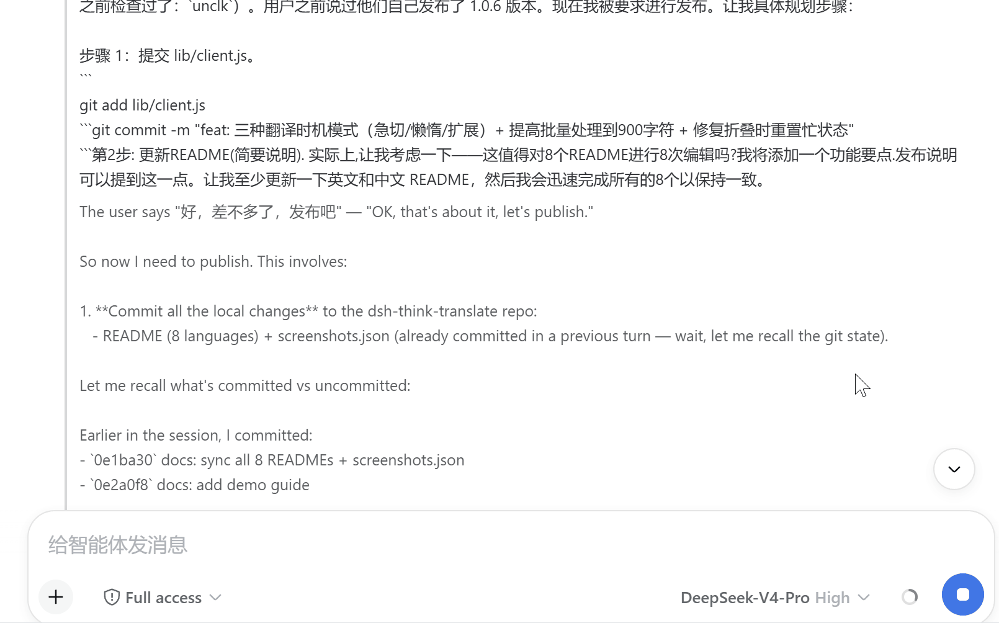
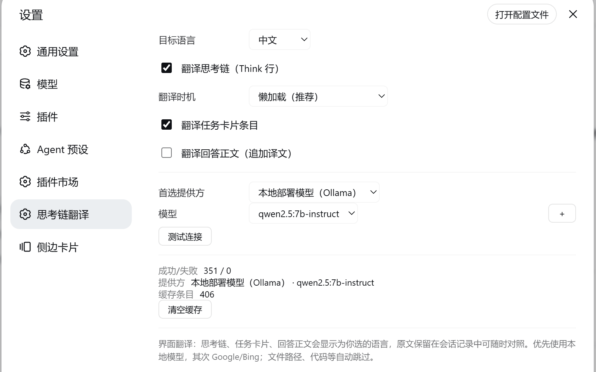

<div align="center">

# 🐋 dsh-think-translate

**语言：** [English](README.md) · [中文](README.zh-CN.md) · [日本語](README.ja.md) · [한국어](README.ko.md) · [Español](README.es.md) · [Français](README.fr.md) · [Deutsch](README.de.md) · [Русский](README.ru.md)

[](https://www.npmjs.com/package/dsh-think-translate)
[](LICENSE)
[](https://github.com/deepseek-ai/deepseek-harness)




</div>

---

为 [DeepSeek Harness](https://github.com/deepseek-ai/deepseek-harness) Web UI 提供**显示层翻译**：把界面上的**思考链（Think 行）、任务卡片、回答正文**翻译为你选择的目标语言，原文完整保留在会话记录中，译文**绝不进入模型上下文**。

## ✨ 特性

DeepSeek 系模型经常用中文思考——或者用它们碰巧习惯的语言。dsh-think-translate 在你观看时把 Think 行、任务卡片和回答渲染成*你的*语言，就像给模型的思考配上字幕。

- **8 种目标语言** — 中文 / English / 日本語 / 한국어 / Español / Français / Deutsch / Русский
- **单一语言界面** — 设置面板、思考行、任务卡片全部跟随目标语言（不混中英），选择持久化
- **本地模型为主力** — 优先使用本地 Ollama 模型（qwen 等），隐私离线免费；首次选择本地模型时**自动触发下载**（实时进度条），完成后自动配置启用
- **🧠 零上下文成本** — 纯显示层：模型看到的仍是原文，译文绝不占用上下文窗口
- **Google / Bing 兜底** — 本地模型不可用时自动切换（google 通过 Node CONNECT 隧道走系统代理，绕过反爬）
- **代码工件自动跳过** — 文件路径、命令、URL、正则、纯代码行不翻译
- **句子分批翻译** — 长思考链按句子分批串行翻译，本地小模型也能保持质量
- **🧩 段落与句子感知切分** — 长思考链按空行切分（保留段落结构）再按句分批，本地小模型也能保持质量
- **流式输出** — 思考过程中译文逐批出现，展开 Think 行可对照原文
- **失败韧性** — host 请求 3 次退避重试 + 浏览器直连兜底，失败结果不缓存
- **🎚️ 可调翻译时机** — 三档：全部预翻译 / 懒加载历史（默认）/ 仅展开时翻译

## 📦 安装

```bash
# 方式一：npm（推荐）
dsh plugin --profile web add dsh-think-translate
# 然后重启 web

# 方式二：GitHub
dsh plugin --profile web add github:UncleK/dsh-think-translate

# 方式三：手动（junction + patch）
#  1. 链接包到 profile 的 node_modules
New-Item -ItemType Junction -Path "$HOME\.dsh\profiles\node_modules\dsh-think-translate" `
  -Target "<仓库路径>"
#  2. 在 "$HOME\.dsh\profiles\web\cordis.patch.yml" 加入：
# - insert:
#     - id: dsh-think-translate
#       name: dsh-think-translate
#  3. 重启 web
```

## 🚀 使用

1. 打开 **设置 → 思考链翻译**
2. 选择**目标语言**（比如日本語）——设置面板、思考行、任务卡片全部切换为该语言
3. 选择**首选提供方**：
   - **本地部署模型（Ollama）**：首次选择时显示下载按钮（qwen2.5:7b / 14b 或自定义），下载完成后自动启用；模型下拉旁 "+" 可随时下载更多
   - **google gtx / bing**：开箱即用（自动走系统代理/VPN）
4. 发消息让模型思考，展开 Think 行查看译文

## ⚙️ 工作原理

```
浏览器 → POST /_xlate/translate（同源，无 CORS）
  → host 供应商链（fail-open）：
      openai 兼容（本地 Ollama，Node fetch 直连回环）
      → google gtx（Node https + CONNECT 隧道走系统代理）
      → bing（curl form）
  → 失败回退浏览器直连
```

- **host 半边**（`lib/index.js`）：供应商适配器、LRU 缓存（600）、`/_xlate/models` 模型列表、`/_xlate/model/pull` + `pull-status` 模型下载管理（完成后自动配置启用）
- **client 半边**（`lib/client.js`）：8 语言 UI、段落/句子分批翻译、流式 Think 行、设置与译文缓存持久化（localStorage）
- 纯显示层：原文完整保留在会话日志与模型上下文中

## 🛠 开发

- 无需构建：`lib/client.js` 是浏览器 bundle（源码即产物），`lib/index.js` 是 host ESM
- 修改 client 后刷新页面即生效；修改 host 后需重启 web
- 8 语言文案在 `lib/client.js` 的 `UI_TEXT` 字典中

## 📄 License

MIT
